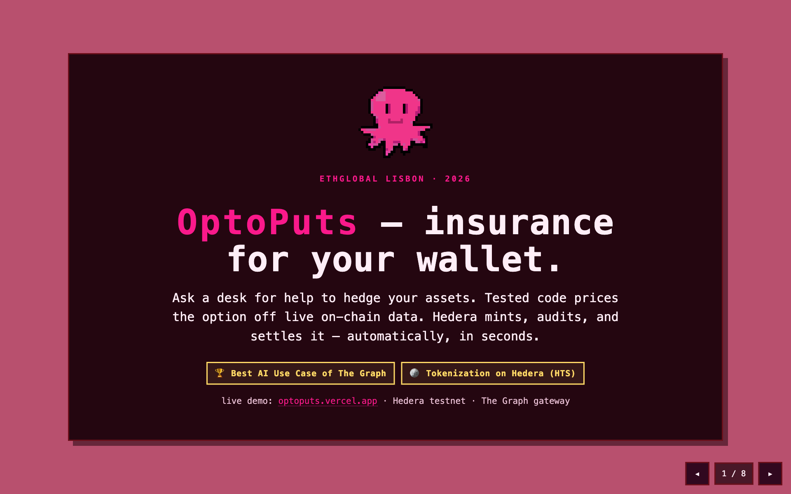
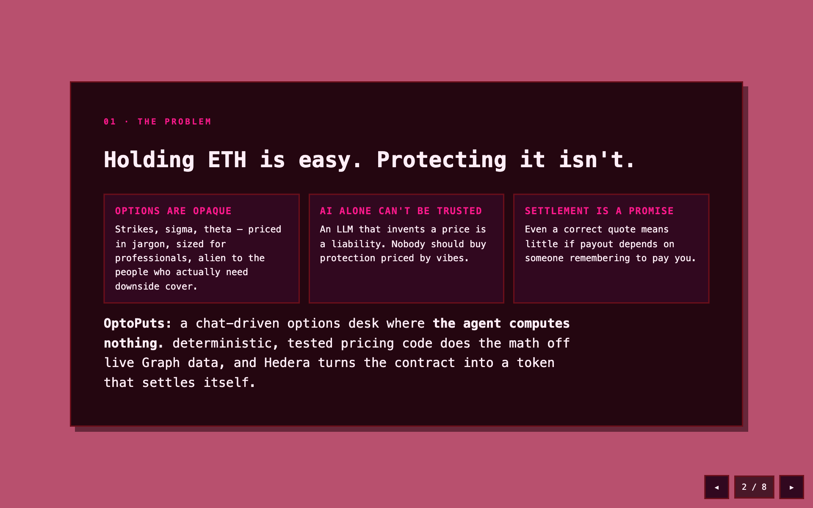
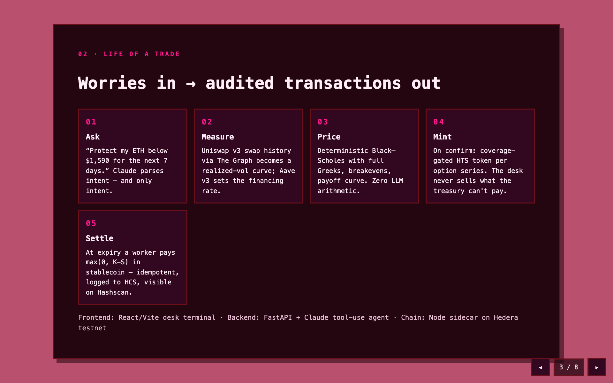
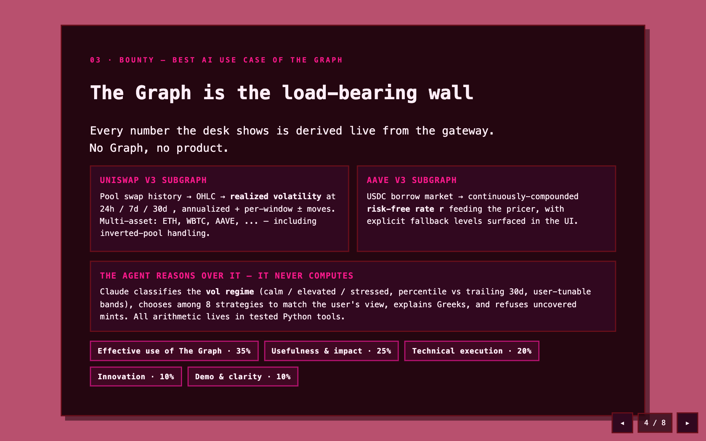
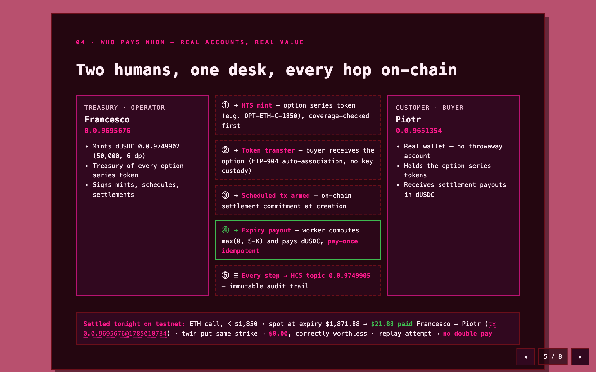
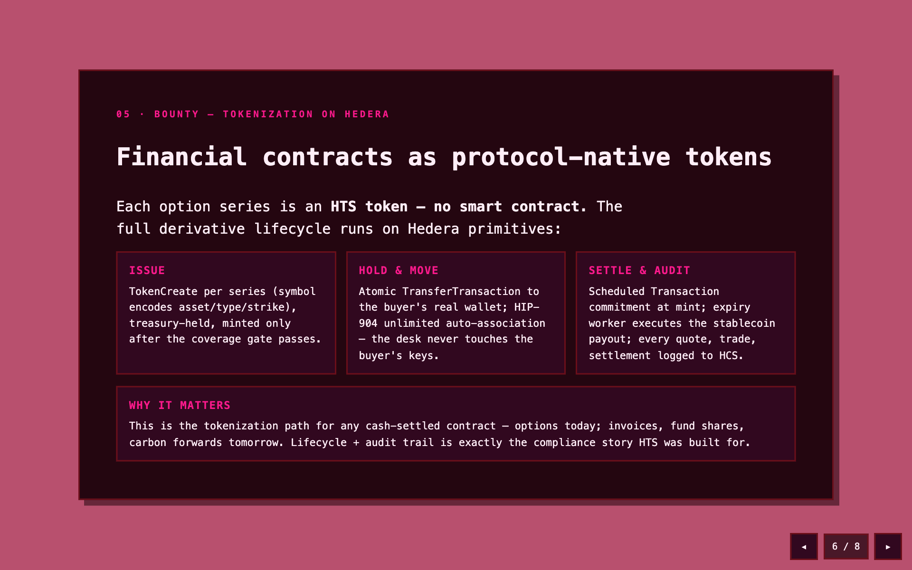
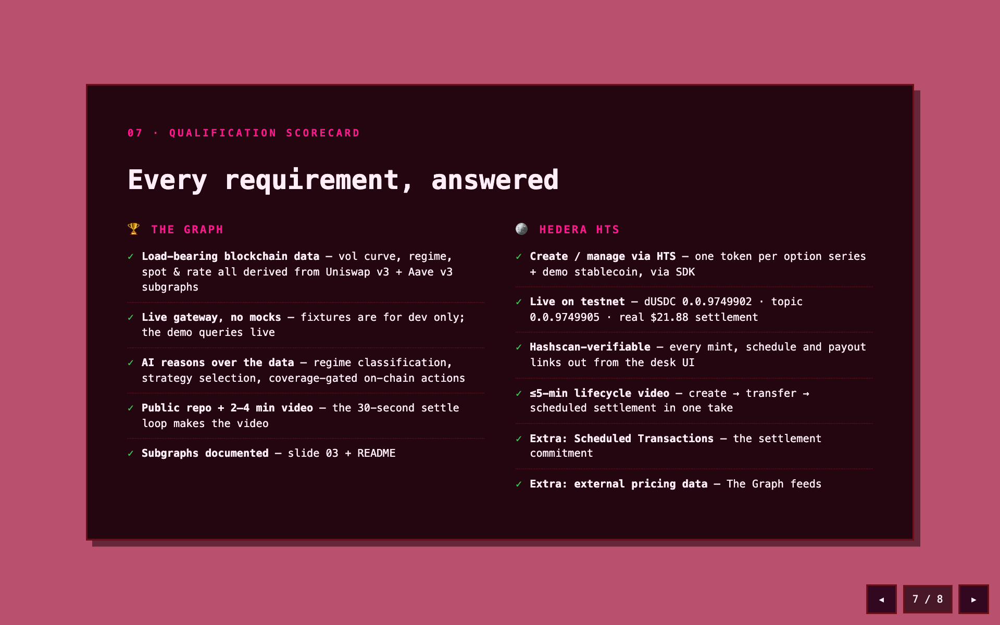
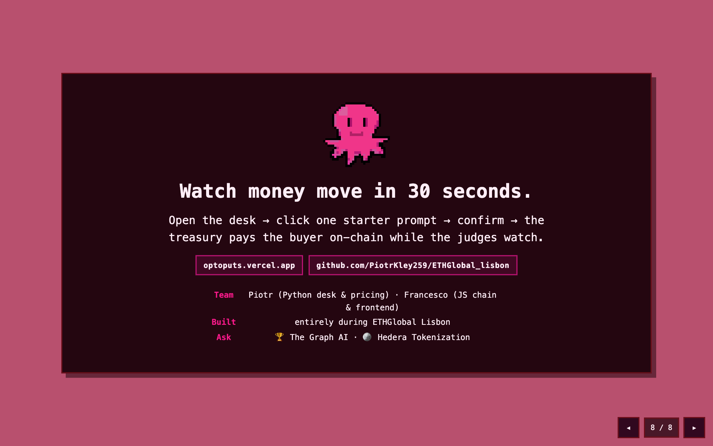

# OptoPuts : an insurance for your wallet 🐙

<p align="center">
  
</p>

A mini options desk for ETH. A deterministic Python engine prices European
cash-settled calls, puts, and multi-leg strategies using **realized volatility
measured from Uniswap v3 trade history** (The Graph); a Claude agent quotes and
explains them in plain language; every sold series is **minted, audit-logged,
and auto-settled on Hedera testnet** (HTS + HCS + Scheduled Transactions).

> *"Protect my ETH below $1,770 for the next week"* → the agent reads live spot
> ($1,858), measures 7-day realized vol (37%), checks the regime, prices the
> put, explains why and on confirmation mints it as an HTS token,
> logs the trade to HCS, and arms on-chain settlement that pays
> max(0, K−S) in demo stablecoin at expiry, automatically.


## Pitch deck
<p align="center"></p>
<p align="center"></p>
<p align="center"></p>
<p align="center"></p>
<p align="center"></p>
<p align="center"></p>
<p align="center"></p>
<p align="center"></p>

The scheduled transfer is the on-chain settlement *commitment*; at expiry a
backend worker computes the payoff from live spot and triggers
`/settlement/execute`, which pays out and writes the settlement record to HCS.
Both settlement endpoints are idempotent per token, the desk can never pay
twice.

## Run it

```bash
cp .env.example .env       # fill: ANTHROPIC_API_KEY, GRAPH_API_KEY, Hedera creds
cd backend && uv sync && uv run pytest          # 86 tests
uv run uvicorn app:app --port 8000              # backend (or: python mock_server.py)
cd ../hedera-sidecar && npm i && npm start      # sidecar :7070 (+ POST /setup once)
                                                # (npm start, NOT run dev — the
                                                #  watcher restarts on state.json)
cd ../frontend && npm i && npm run dev          # UI
```

`OFFLINE_MODE=1` runs the whole desk from committed fixtures, zero network.
